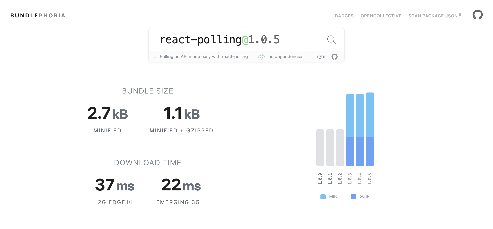

# 🔔 react-polling
[](#contributors)


[](https://travis-ci.com/vivek12345/react-polling)

Easy to use polling service built with react that follows the render props pattern.

**Note: Read more about render props here  [Render Props Pattern](https://reactjs.org/docs/render-props.html)**

### 🚚 Installation

```
yarn add react-polling
```

or

```
npm i react-polling --save
```

### ⚡️ Usage

### Default usage (the lib will internally use fetch to make api calls)

```javascript
import React from 'react';

<ReactPolling
  url={'url to poll'}
  interval= {3000} // in milliseconds(ms)
  retryCount={3} // this is optional
  onSuccess={() => console.log('handle success')}
  onFailure={() => console.log('handle failure')} // this is optional
  method={'GET'}
  headers={headers object} // this is optional
  body={JSON.stringify(data)} // data to send in a post call. Should be stringified always
  render={({ startPolling, stopPolling, isPolling }) => {
    if(isPolling) {
      return (
        <div> Hello I am polling</div>
      );
    } else {
      return (
        <div> Hello I stopped polling</div>
      );
    }
  }}
/>
```


### Custom lib for making api calls (provide us your promise function and we will use that to make api calls)

```javascript
import React from 'react';
// import of some lib for making http calls
// let's say you are using axios
import axios from "axios";

const fetchData = () => {
  // return a promise
  return axios.get("some polling url");
}

const App = () => {
  return (
    <ReactPolling
      url={'url to poll'}
      interval= {3000} // in milliseconds(ms)
      retryCount={3} // this is optional
      onSuccess={() => console.log('handle success')}
      onFailure={() => console.log('handle failure')} // this is optional
      promise={fetchData} // custom api calling function that should return a promise
      render={({ startPolling, stopPolling, isPolling }) => {
        if(isPolling) {
          return (
            <div> Hello I am polling</div>
          );
        } else {
          return (
            <div> Hello I stopped polling</div>
          );
        }
      }}
    />
  );
}
```

## 📒 Api

### 🔔 react-polling

| Props                   | Type                   | Default   | Description                                                                                         |
|-------------------------|------------------------|-----------|-----------------------------------------------------------------------------------------------------|
| url                     | string                 | null      | url/api to poll                                                                                     |
| interval                | number                 | 3000      | Interval of polling                                                                                 |
| retryCount              | number                 | 0         | Number of times to retry when an api polling call fails                                             |
| onSuccess               | function               | -         | Callback function on successful polling. This should return true to continue polling                |
| onFailure               | function               | () => {}  | Callback function on failed polling or api failure                                                  |
| method                  | string                 | GET       | HTTP Method of the api to call                                                                      |
| headers                 | object                 | -         | Any specific http headers that need to be sent with the request                                     |
| body                    | object                 | -         | The data that need to be sent in a post/put call                                                    |
| render                  | function               | -         | Render function to render the ui                                                                    |
| promise                 | function               | -         | custom function that should return a promise                                                                    |
| backOffFactor                 | number               | 1         | exponential back off factor for api polling(interval*backOffFactor)                                                                    |
| children                | function               | -         | React children function based on child props pattern                                                |

#### onSuccess (required)

This function will be called every time the polling service gets a successful response.
You should return true to continue polling and false to stop polling. It has the following signature:

```javascript
function onSuccess(response) {
  // You can do anything with this response, may be add to an array of some state of your react component
  // return true to continue polling
  // return false to stop polling
}
```

#### onFailure (not compulsory field)

This function will be called every time the polling service gets a failure response from the api, it can be 401 or 500 or any failure status code.
You can do some cleaning up of your variables or reseting the state here.

```javascript
function onFailure(error) {
  // You can log this error to some logging service
  // clean up some state and variables.
}
```

#### promise (when you need your own api calling logic and not the default fetch which this lib uses)
This function will be called every time the polling service wants to poll for some data.
Ideally inside this function you should write your api calling logic.

```javascript
function fetchPosts() {
  return axios.get("some url");
}
```

#### backOffFactor(default is 1) (not compulsory field)
This option is only needed if you want to exponentially increase the rate at which we poll the api.
For example 
* if `backOffFactor` is 2 and `interval` is 3000, then the first polling call will be made after 3000ms
* Next polling call will happen after `interval*backOffFactor` = 3000*2 = 6000ms later


## 📦 Size



## 👻 Examples

* Basic Usage (https://codesandbox.io/s/react-polling-basic-usage-zie3j?file=/src/App.js)

* Using custom promises (https://codesandbox.io/s/react-polling-custom-promise-example-n54eb?file=/src/App.js)

* Dynamic Url (https://codesandbox.io/s/react-polling-custom-promise-dynamic-url-3z7h2?file=/src/App.js)

## 👍 Contribute

Show your ❤️ and support by giving a ⭐. Any suggestions and pull request are welcome !

### 📝 License

MIT © [viveknayyar](https://github.com/vivek12345)

## 👷 TODO

- [x] Complete README
- [x] Add Examples and Demo
- [x] Test Suite

## Contributors

Thanks goes to these wonderful people ([emoji key](https://github.com/kentcdodds/all-contributors#emoji-key)):

<!-- ALL-CONTRIBUTORS-LIST:START - Do not remove or modify this section -->
<!-- prettier-ignore -->
| [<br /><sub><b>Vivek Nayyar</b></sub>](https://www.viveknayyar.in/)<br />[📖](https://github.com/vivek12345/react-polling/commits?author=vivek12345 "Documentation") [💻](https://github.com/vivek12345/react-polling/commits?author=vivek12345 "Code") [🎨](#design-vivek12345 "Design") [💡](#example-vivek12345 "Examples") |
| :---: |
<!-- ALL-CONTRIBUTORS-LIST:END -->

This project follows the [all-contributors](https://github.com/kentcdodds/all-contributors) specification. Contributions of any kind welcome!